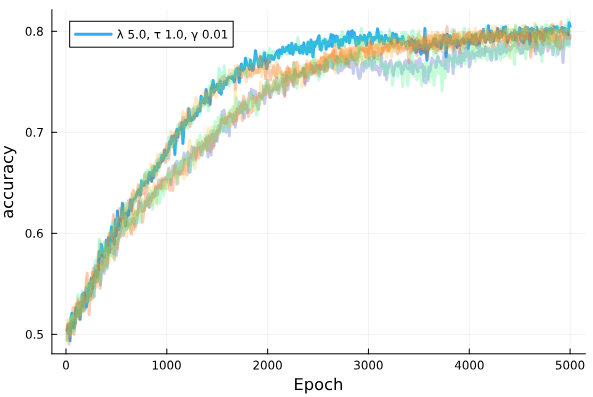
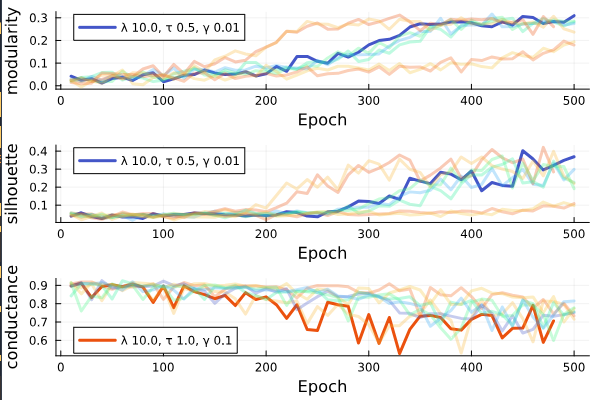
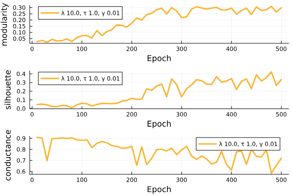
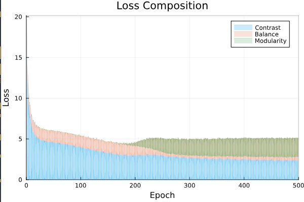
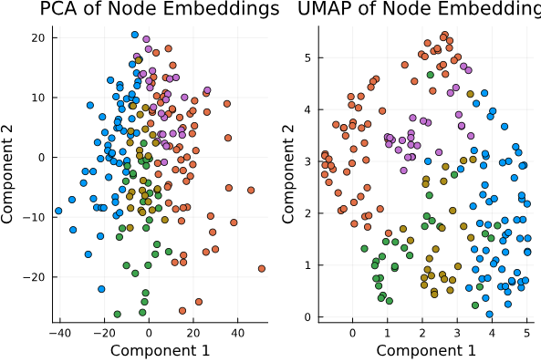

# README

Entry is the main.jl file. Will precompile this at some point!

Modularity is currently the target metric for GNN training. We have seen modularity between 0.05 to 0.3 depending on the run of the GNN -- stabilises between 0.2 and 0.4. Discriminator accuracy is typically around 0.75 to 0.85.

Model needs to be trained against the full dataset. At present, this is just testing of the model architecture.

## Output

Examining the clusters (produced via a basic, unrefined KMeans), we get evidence of repulsion & attraction working effectively. If we compare this to the composite graph, we can see the repulsive effects more clearly.

📦 Model Parameters:
  • γ          = 0.01
  • λ          = 10.0
  • τ          = 1.0
  • epochs     = 500

📈 Embedding Quality:
  • Number of Clusters: 5
  • Mean Norm:          31.036
  • Variance of Norms:  109.779
  • Modularity:         0.075
  • Silhouette Score:   0.115
  • Conductance:        0.747

🔁 Intra-Cluster Rates (Composite):
  • negative_intra    = 0.211
  • positive_intra    = 0.349

🌐 Intra-Cluster Rates (Per View):
  • influence       intra = 0.272
  • friendship      intra = 0.337
  • more_time       intra = 0.427
  • advice          intra = 0.414
  • disrespect      intra = 0.211
  • feedback        intra = 0.404
  • affiliation     intra = 0.236

